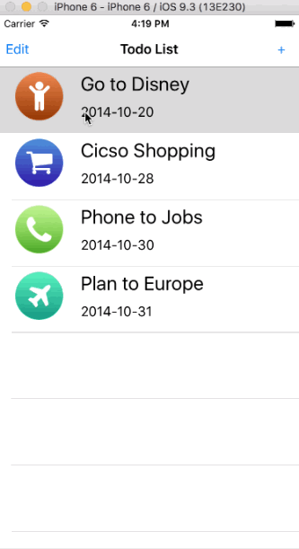

Todo
==========
Todo is iOS App written by Swift. i studied these fundementals of swift and TODO app in "Jakelin's" course in "imooc.com" and demonstrates how to manipulate tableview. This app shows a way to implement tableview add, edit and delete functions.

## Screenshots
Real ==Tracking App Negotiated By  J.Mathangan

